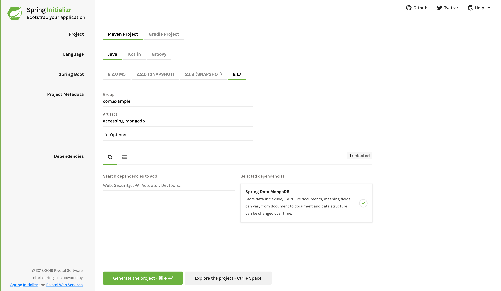

:toc:
:icons: font
:source-highlighter: prettify
:project_id: gs-accessing-data-mongodb

This guide walks you through the process of using
https://projects.spring.io/spring-data-mongodb/[Spring Data MongoDB] to build an
application that stores data in and retrieves it from https://www.mongodb.org/[MongoDB], a
document-based database.

== What You Will build

You will store `Customer` POJOs (Plain Old Java Objects) in a MongoDB database by using
Spring Data MongoDB.

== What You Need

:java_version: 1.8
include::https://raw.githubusercontent.com/spring-guides/getting-started-macros/master/prereq_editor_jdk_buildtools.adoc[]

include::https://raw.githubusercontent.com/spring-guides/getting-started-macros/master/how_to_complete_this_guide.adoc[]

[[scratch]]
== Starting with Spring Initializr

For all Spring applications, you should start with the https://start.spring.io[Spring
Initializr]. The Initializr offers a fast way to pull in all the dependencies you need for
an application and does a lot of the set up for you. This example needs only the Spring
Data MongoDB dependency. The following image shows the Initializr set up for this sample
project:

NOTE: The preceding image shows the Initializr with Maven chosen as the build tool. You
can also use Gradle. It also shows values of `com.example` and `accessing-data-mongodb` as
the Group and Artifact, respectively. You will use those values throughout the rest of
this sample.

The following listing shows the `pom.xml` file created when you choose Maven:

====
[src,xml]
----
include::complete/pom.xml[]
----
====

The following listing shows the `build.gradle` file created when you choose Gradle:

====
[src,groovy]
----
include::complete/build.gradle[]
----
====

[[initial]]
== Install and Launch MongoDB

With your project set up, you can install and launch the MongoDB database.

If you use a Mac with Homebrew, you can run the following command:

====
[src,bash]
----
$ brew install mongodb
----
====

With MacPorts, you can run the following command:

====
[src,bash]
----
$ port install mongodb
----
====

For other systems with package management, such as Redhat, Ubuntu, Debian, CentOS, and
Windows, see the instructions at https://docs.mongodb.org/manual/installation/.

After you install MongoDB, you can launch it in a console window by running the following
command (which also starts up a server process):

====
[src,bash]
----
$ mongod
----
====

You should see output similar to the following:

====
[src,bash]
----
all output going to: /usr/local/var/log/mongodb/mongo.log
----
====

== Define a Simple Entity

MongoDB is a NoSQL document store. In this example, you store `Customer` objects. The
following listing shows the Customer class (in
`src/main/java/com/example/accessingdatamongodb/Customer.java`):

====
[source,java,tabsize=2]
----
include::complete/src/main/java/com/example/accessingdatamongodb/Customer.java[]
----
====

Here you have a `Customer` class with three attributes: `id`, `firstName`, and `lastName`.
The `id` is mostly for internal use by MongoDB. You also have a single constructor to
populate the entities when creating a new instance.

NOTE: In this guide, the typical getters and setters have been left out for brevity.

`id` fits the standard name for a MongoDB ID, so it does not require any special
annotation to tag it for Spring Data MongoDB.

The other two properties, `firstName` and `lastName`, are left unannotated. It is assumed
that they are mapped to fields that share the same name as the properties themselves.

The convenient `toString()` method prints out the details about a customer.

NOTE: MongoDB stores data in collections. Spring Data MongoDB maps the `Customer` class
into a collection called `customer`. If you want to change the name of the collection, you
can use Spring Data MongoDB's
https://docs.spring.io/spring-data/data-mongodb/docs/current/api/org/springframework/data/mongodb/core/mapping/Document.html[`@Document`]
annotation on the class.

== Create Simple Queries

Spring Data MongoDB focuses on storing data in MongoDB. It also inherits functionality
from the Spring Data Commons project, such as the ability to derive queries. Essentially,
you need not learn the query language of MongoDB. You can write a handful of methods and
the queries are written for you.

To see how this works, create a repository interface that queries `Customer` documents, as
the following listing (in
  `src/main/java/com/example/accessingdatamongodb/CustomerRepository.java`) shows:

====
[source,java,tabsize=2]
----
include::complete/src/main/java/com/example/accessingdatamongodb/CustomerRepository.java[]
----
====

`CustomerRepository` extends the `MongoRepository` interface and plugs in the type of
values and ID that it works with: `Customer` and `String`, respectively. This interface
comes with many operations, including standard CRUD operations
(create, read, update, and delete).

You can define other queries by declaring their method signatures. In this case, add
`findByFirstName`, which essentially seeks documents of type `Customer` and finds the
documents that match on `firstName`.

You also have `findByLastName`, which finds a list of people by last name.

In a typical Java application, you write a class that implements `CustomerRepository` and
craft the queries yourself. What makes Spring Data MongoDB so useful is the fact that you
need not create this implementation. Spring Data MongoDB creates it on the fly when you
run the application.

Now you can wire up this application and see what it looks like!

== Create an Application Class

Spring Initializr creates a simple class for the application. The following listing shows
the class that Initializr created for this example (in
`src/main/java/com/example/accessingdatamongodb/AccessingDataMongodbApplication.java`):

====
[source,java,tabsize=2]
----
include::initial/src/main/java/com/example/accessingdatamongodb/AccessingDataMongodbApplication.java[]
----
====

include::https://raw.githubusercontent.com/spring-guides/getting-started-macros/master/spring-boot-application-new-path.adoc[]

Spring Boot automatically handles those repositories as long as they are included
in the same package (or a sub-package) of your `@SpringBootApplication` class. For more
control over the registration process, you can use the `@EnableMongoRepositories`
annotation.

NOTE: By default, `@EnableMongoRepositories` scans the current package for any interfaces
that extend one of Spring Data's repository interfaces. You can use its
`basePackageClasses=MyRepository.class` to safely tell Spring Data MongoDB to scan a
different root package by type if your project layout has multiple projects and it does
not find your repositories.

Spring Data MongoDB uses the `MongoTemplate` to execute the queries behind your `find*`
methods. You can use the template yourself for more complex queries, but this guide does
not cover that. (see the
https://docs.spring.io/spring-data/mongodb/docs/current/reference/html/[Spring Data
MongoDB Reference Guide])

Now you need to modify the simple class that the Initializr created for you. You need to
set up some data and use it to generate output. The following listing shows the finished
`AccessingDataMongodbApplication` class (in
`src/main/java/com/example/accessingdatamongodb/AccessingDataMongodbApplication.java`):

====
[source,java,tabsize=2]
----
include::complete/src/main/java/com/example/accessingdatamongodb/AccessingDataMongodbApplication.java[]
----
====

`AccessingDataMongodbApplication` includes a `main()` method that autowires an instance of
`CustomerRepository`. Spring Data MongoDB dynamically creates a proxy and injects it
there. We use the `CustomerRepository` through a few tests. First, it saves a handful of
`Customer` objects, demonstrating the `save()` method and setting up some data to use.
Next, it calls `findAll()` to fetch all `Customer` objects from the database. Then it
calls `findByFirstName()` to fetch a single `Customer` by her first name. Finally, it
calls `findByLastName()` to find all customers whose last name is `Smith`.

NOTE: By default, Spring Boot tries to connect to a locally hosted instance of
MongoDB. Read the
https://docs.spring.io/spring-boot/docs/current/reference/htmlsingle/#boot-features-mongodb[reference docs]
for details on pointing your application to an instance of MongoDB hosted elsewhere.

include::https://raw.githubusercontent.com/spring-guides/getting-started-macros/master/build_an_executable_jar_mainhead.adoc[]
include::https://raw.githubusercontent.com/spring-guides/getting-started-macros/master/build_an_executable_jar_with_both.adoc[]

As `AccessingDataMongodbApplication` implements `CommandLineRunner`, the `run` method is
automatically invoked when Spring Boot starts. You should see something like the following
(with other output, such as queries, as well):

====
[src,bash]
----
== Customers found with findAll():
Customer[id=51df1b0a3004cb49c50210f8, firstName='Alice', lastName='Smith']
Customer[id=51df1b0a3004cb49c50210f9, firstName='Bob', lastName='Smith']

== Customer found with findByFirstName('Alice'):
Customer[id=51df1b0a3004cb49c50210f8, firstName='Alice', lastName='Smith']
== Customers found with findByLastName('Smith'):
Customer[id=51df1b0a3004cb49c50210f8, firstName='Alice', lastName='Smith']
Customer[id=51df1b0a3004cb49c50210f9, firstName='Bob', lastName='Smith']
----
====

== Summary

Congratulations! You set up a MongoDB server and wrote a simple application that uses
Spring Data MongoDB to save objects to and fetch them from a database, all without writing
a concrete repository implementation.

NOTE: If you want to expose MongoDB repositories with a hypermedia-based RESTful front end
with little effort, read
link:/guides/gs/accessing-mongodb-data-rest[Accessing MongoDB Data with REST].

== See Also

The following guides may also be helpful:

* https://spring.io/guides/gs/accessing-mongodb-data-rest[Accessing MongoDB Data with REST]
* https://spring.io/guides/gs/accessing-data-jpa/[Accessing Data with JPA]
* https://spring.io/guides/gs/accessing-data-gemfire/[Accessing Data with Gemfire]
* https://spring.io/guides/gs/accessing-data-mysql/[Accessing data with MySQL]
* https://spring.io/guides/gs/accessing-data-neo4j/[Accessing Data with Neo4j]

include::https://raw.githubusercontent.com/spring-guides/getting-started-macros/master/footer.adoc[]
